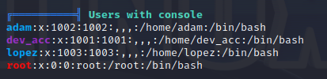

# 内存取证——获取windows设备网卡guid

## 所需工具

1. kali 虚拟机
2. volatility

## 具体步骤

关于windows设备的相关硬件信息，可以在注册表中找到相关信息。

### 0- 获取内存系统版本

具体指令如下：

```sh
volatility -f xxx.raw imageinfo
```

<figure><figcaption></figcaption></figure>

### 1- 获取注册表地址

获取注册表，所需信息在 \SystemRoot\System31\Config\DEFAULT

```
volatility -f xxx.raw --profile=Win7SP1x64 hivelist
```

<figure><figcaption></figcaption></figure>

### 2- 获取网卡信息

网卡信息的路径在&#x20;

Microsoft\Windows NT\CurrentVersion\NetworkCards

可能会有多个子文件，对应多张网卡

```bash
$ volatility -f xxx,raw --profile=Win7SP1x64 -o 0xfffffa001b40010 printkey -K "Microsoft Windows NT CurrentVersion\NetworkCards\8
```

<figure><figcaption></figcaption></figure>

