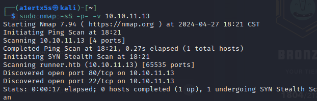
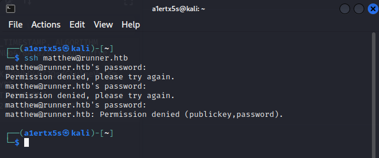

# Season 5 Week 1 - Runner

<figure><figcaption><p>Runner 页面</p></figcaption></figure>

## 初期信息收集

首先先用nmap之类的工具扫描一下端口。

<figure><figcaption></figcaption></figure>

主要就是开放了80和22端口&#x20;

接着访问一下web服务,自动跳转runner.htb,所以到/etc/hosts文件下添加一下解析.

```
10.10.11.13 runner.htb
```

<figure><figcaption></figcaption></figure>

首页发现CI/CD之类的词汇,可以知道runner是一个CI/CD的工具,在后面的页面会发现 powered by TeamCity.


这里确实不是很常规,耗了挺长时间,htb是虚拟环境,没啥手段进行子域名的信息收集,通过爆破获得一个子域名 teamcity.runner.htb , 访问可以确定是存在TeamCity的服务.

<figure><figcaption></figcaption></figure>

## 拿下第一个flag

这时候到exploit-db搜索一下teamcity,可以发现存在一个RCE的漏洞,且版本号都是2023.05.3.

<figure><figcaption></figcaption></figure>

使用改脚本,会创建一个admin权限的teamcity用户.

<figure><figcaption></figcaption></figure>

使用该账号密码登录teamcity.

<figure><figcaption></figcaption></figure>

成功进入,然后探索一下.可以发现在Administration下面有个Backup选项,可以创建一个备份.(如果有备份,就是有人已经创建了,如果没备份,就点击一下Start Backup)

<figure><figcaption></figcaption></figure>

下载备份.

<pre><code><strong>/data/teamcity_server/datadir/backup/TeamCity_Backup_20240427_101141.zip 
</strong></code></pre>

在备份文件的/database\_dump/users文件中,可以获取用户的密码hash值.

<figure><figcaption></figcaption></figure>

Bcrypt加密方式,用hackcat跑一下,字典有用rockyou.txt,只有matthew用户可以跑出结果,密码是piper123 (忘了截图了,偷个懒不再跑了)

然后尝试一下ssh,结果登陆不上去,🐔.

<figure><figcaption></figcaption></figure>

后来想到在teamcity网站里收集信息的时候,有发现一个SSH keys存储相关的页面,我们可以获取到公钥,按道理在这里生成的key,应该项目中也存在私钥,然后翻备份,果然有!!

<figure><figcaption></figcaption></figure>

然后把前面获取到的user的名称都试一下,可以知道这个是john的私钥(使用私钥的时候要给权限600,chmod 6000 id\_rsa)

<figure><figcaption></figcaption></figure>

然后用户目录下就能找到第一个flag了

<figure><figcaption></figcaption></figure>

## 再次信息收集

上linux信息收集神器 linpeas .

<figure><figcaption></figcaption></figure>

给出了可能存在的提权漏洞,很可惜,尝试以后都不可用.

然后在分析出来的nginx配置文件中,可以发现还有一个portainer服务 portainer-administration.runner.htb&#x20;

这里就有些思路了,如果portainer如果有操作docker的权限,就可以创建一个volumn,指向宿主机的根目录,然后挂载到一个容器上,就可以通过这个容器访问到root权限下的文件.

这里偷懒了,在走到这步时候,已经有人创建一个容器了,成功在/mnt/root下访问到根目录,在/mnt/root/root下发现root.txt文件,拿下第二个flag!

<figure><figcaption></figcaption></figure>
